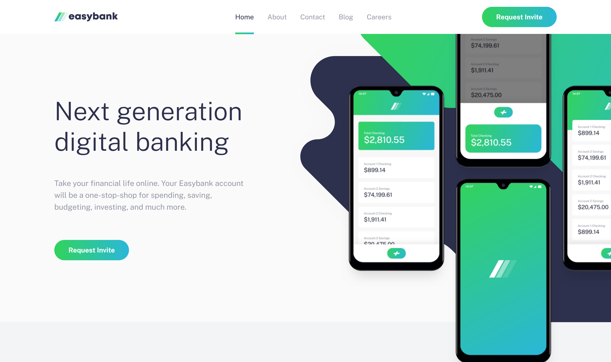

# Frontend Mentor - Easybank landing page solution

This is a solution to the [Easybank landing page challenge on Frontend Mentor](https://www.frontendmentor.io/challenges/easybank-landing-page-WaUhkoDN). Frontend Mentor challenges help you improve your coding skills by building realistic projects.

## Table of contents

- [The challenge](#the-challenge)
- [Screenshot](#screenshot)
- [Links](#links)
- [My process](#my-process)
  - [Built with](#built-with)
- [Author](#author)

### The challenge

Users should be able to:

- View the optimal layout for the site depending on their device's screen size
- See hover states for all interactive elements on the page

### Screenshot

### Links

- Solution URL: [github repo](https://github.com/Getch67/easybank-landing-page)
- Live Site URL: [live website](https://getch67.github.io/easybank-landing-page/)

## My process

As always, I began by analyzing the design images to gain a clear understanding of the HTML structure, CSS layout, and the number of React components required. Once I had a solid grasp of the design, I proceeded with the development, building the components step by step.

### Built with

- React – A JavaScript library for building user interfaces.
- Tailwind CSS – A utility-first CSS framework for rapid UI development.
- Vite – A fast build tool and development server for modern web projects, used for setting up and bundling the project.

## Author

- Frontend Mentor - [@Getch67](https://www.frontendmentor.io/profile/Getch67)
